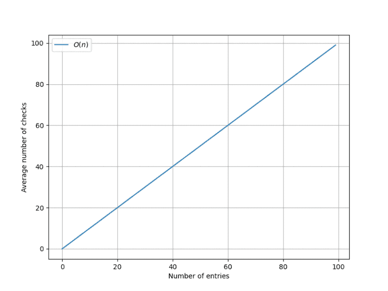
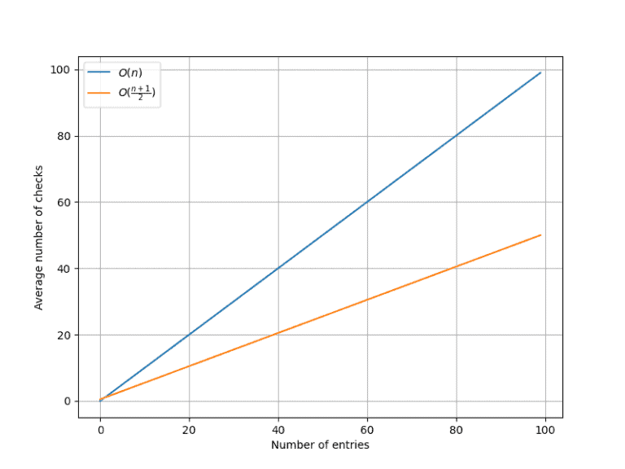
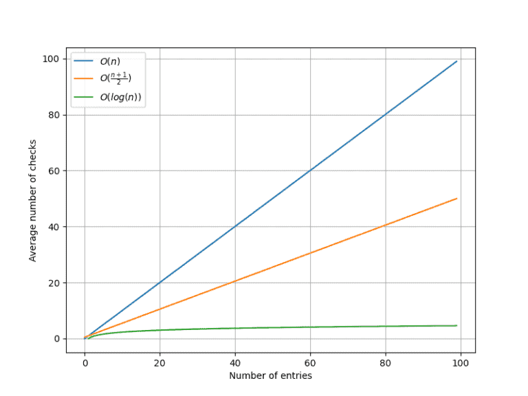

# [数据库索引是如何工作的？](https://www.baeldung.com/sql/databases-indexing)

数据库概念

索引

1. 简介

    数据库索引是现代数据库中高效数据检索的关键组成部分。它在优化查询性能和加速数据检索操作方面发挥着重要作用。在本教程中，我们将深入探讨数据库索引的内部工作机制、其优点和局限性。

2. 数据库

    1. SQL 数据库

        为了理解索引，我们首先快速回顾一下数据库的概念。数据库是一种系统化的方式，用于可靠地插入、存储、更新、检索和删除数据。从历史上看，SQL 数据库是最先出现的，并因其多功能性和稳健性而经受住了时间的考验。它们的工作原理是将各种实体的信息存储在由行和列组成的表中：数据库和表。

    2. 表结构与列

        在一个表中，数据被组织成行，每一行代表一条记录或条目。另一方面，列定义了这些记录的各种属性或特性。为了说明这一点，我们来看一个包含三列的简单表格：ID、电子邮件和姓名。以下是一个示例：

        | 主键 (Primary Key) | 唯一列 (Unique Column)  | 非唯一列 (Non-unique Column) |
        | ------------------ | ----------------------- | ---------------------------- |
        | ID                 | 电子邮件                | 姓名                         |
        | 1                  | michael.scott@gmail.com | Michael                      |
        | 2                  | bob.smith@yahoo.com     | Bob                          |
        | 3                  | michael.brown@gmail.com | Michael                      |

        对于我们的需求，列可以分为三种类型：

        - **主键**：每张表中只有一个主键，通过唯一值标识表中的每个条目。
        - **唯一列**：每张表中可能有零个、一个或多个唯一列，定义了每行唯一的属性。
        - **非唯一列**：每张表中可能有零个、一个或多个非唯一列，定义了允许重复值的属性。

        因此，每个用户通过其 ID 被唯一标识，拥有唯一的电子邮件地址，但姓名可能与其他用户共享。

3. 索引

    让我们来谈谈索引。当我们对某列建立索引时，会通过后台维护一个额外的数据结构来加快搜索速度。这使得在处理大量数据时，所有搜索操作都显著加快。

    1. 搜索非唯一列

        假设我们要查找名为“Michael”的用户。由于多个用户可能拥有这个名字，我们需要遍历表中的所有行以确保找到所有匹配项。如果有 $n$ 行，我们平均需要遍历 $O(n)$ 行才能找到答案。以下是标准列中查找速度的图表：

        

    2. 搜索唯一列

        假设我们要查找电子邮件为“<michael.scott@gmail.com>”的用户。由于电子邮件应该是唯一的，一旦找到目标行即可停止搜索。如果有 $n$ 行，我们平均需要遍历 $O(\frac{n + 1}{2})$ 行才能找到答案。以下是唯一列中查找速度的图表：

        

    3. 搜索主键

        假设我们要查找 ID 等于 4291 的用户。由于 ID 是主键，我们可以保证搜索步骤显著减少。事实上，如果有 $n$ 行，我们平均只需要遍历 $O(\log(n))$ 行就能找到答案。最后，以下是主键列搜索性能的图表：

        

        为了理解这三种情况的差异，我们可以查看下表：

        | 表大小（条目数） | $O(n)$   | $O((n+1)/2)$ | $O(\log(n))$ |
        | ---------------- | -------- | ------------ | ------------ |
        | 10               | 10       | 6            | 4            |
        | 1000             | 1000     | 501          | 10           |
        | 100000           | 100000   | 50001        | 17           |
        | 10000000         | 10000000 | 5000001      | 24           |

        不仅是 $O(\log(n))$ 版本始终比其他两种方法更快，而且随着数据库规模增大，这种差异变得天文数字般巨大。这可能是等待几秒钟完成查询与等待几个小时之间的区别。

    4. 搜索索引列

        索引的核心思想是使特定列的搜索速度接近主键搜索的速度。假设检查电子邮件地址是否存在于数据库中是我们经常执行的操作，我们应该对其进行优化。我们不希望用电子邮件列替换主键 ID，因为我们需要允许用户更改电子邮件地址而不丢失身份。在这种情况下，解决方案是对电子邮件列创建数据库索引。下表展示了查询中使用的列类型与平均检查次数之间的关系：

        | 表大小（条目数） | 普通列   | 唯一列  | 主键/索引 |
        | ---------------- | -------- | ------- | --------- |
        | 10               | 10       | 6       | 4         |
        | 1000             | 1000     | 501     | 10        |
        | 100000           | 100000   | 50001   | 17        |
        | 10000000         | 10000000 | 5000001 | 24        |

4. 性能

    在本节中，我们将讨论一些性能方面的考虑因素，帮助决定是否需要对某列创建索引。我们将从以下未应用任何索引的用户表开始：

    | ID  | 姓名         | 电话     | 电子邮件          | 地址         | 性别 |
    | --- | ------------ | -------- | ----------------- | ------------ | ---- |
    | 1   | John Doe     | 555-1234 | john@example.com  | 123 Main St  | 男性 |
    | 2   | Jane Smith   | 555-5678 | jane@example.com  | 456 Elm St   | 女性 |
    | 3   | Alex Johnson | 555-9876 | alex@example.com  | 789 Oak Ave  | 男性 |
    | 4   | Lisa Davis   | 555-4321 | lisa@example.com  | 321 Pine St  | 女性 |
    | 5   | Mark Wilson  | 555-2468 | mark@example.com  | 654 Cedar Rd | 男性 |
    | 6   | Emily Brown  | 555-8642 | emily@example.com | 987 Maple Ln | 女性 |

    1. 多列索引

        索引的主要目的是大幅提高数据库检索性能。然而，这也伴随着权衡。虽然涉及索引列的查询速度显著提升，但每次插入、更新或删除操作都会变慢。索引越多，修改条目所需的时间越长，而且每个条目占用的空间也显著增加。考虑到这一点，我们可以考虑对“电话”和“电子邮件”列进行索引，因为这些列在登录时非常有用：

        | ID  | 姓名         | 电话     | 电子邮件          | 地址         | 性别 |
        | --- | ------------ | -------- | ----------------- | ------------ | ---- |
        | 1   | John Doe     | 555-1234 | john@example.com  | 123 Main St  | 男性 |
        | 2   | Jane Smith   | 555-5678 | jane@example.com  | 456 Elm St   | 女性 |
        | 3   | Alex Johnson | 555-9876 | alex@example.com  | 789 Oak Ave  | 男性 |
        | 4   | Lisa Davis   | 555-4321 | lisa@example.com  | 321 Pine St  | 女性 |
        | 5   | Mark Wilson  | 555-2468 | mark@example.com  | 654 Cedar Rd | 男性 |
        | 6   | Emily Brown  | 555-8642 | emily@example.com | 987 Maple Ln | 女性 |

        但我们不应该对“姓名”和“地址”列进行索引。这将是过度设计，因为通过地址或姓名快速查找用户通常不是实际应用场景中的需求。

    2. 对低基数列进行索引

        低基数列（即相对于总记录数具有少量不同值的列）对索引提出了挑战。在这种情况下，索引可能不会显著提高性能，因为它仍然需要扫描表的大部分内容。在决定是否创建索引之前，评估列的基数和唯一性非常重要。例如，对我们表中的“性别”列进行索引是非常无效的，因为它只有两个可能的值：

        | ID  | 姓名         | 电话     | 电子邮件          | 地址         | 性别 |
        | --- | ------------ | -------- | ----------------- | ------------ | ---- |
        | 1   | John Doe     | 555-1234 | john@example.com  | 123 Main St  | 男性 |
        | 2   | Jane Smith   | 555-5678 | jane@example.com  | 456 Elm St   | 女性 |
        | 3   | Alex Johnson | 555-9876 | alex@example.com  | 789 Oak Ave  | 男性 |
        | 4   | Lisa Davis   | 555-4321 | lisa@example.com  | 321 Pine St  | 女性 |
        | 5   | Mark Wilson  | 555-2468 | mark@example.com  | 654 Cedar Rd | 男性 |
        | 6   | Emily Brown  | 555-8642 | emily@example.com | 987 Maple Ln | 女性 |

5. 结论

    在本文中，我们讨论了为什么数据库索引在优化查询性能和提高数据检索操作的整体效率方面至关重要。通过创建高效的数据结构并在搜索过程中加以利用，索引显著降低了查询的时间复杂度。它允许快速访问特定记录，尤其是在涉及唯一列或主键列的情况下。
