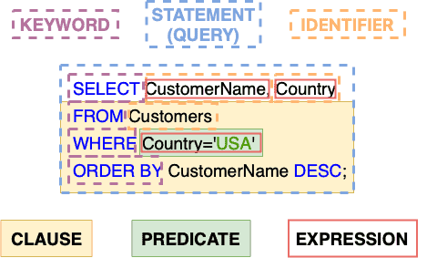

# [SQL中的语句与查询](https://www.baeldung.com/sql/sql-statements-queries)

SQL 查询

1. 简介

    结构化查询语言（SQL）是一种广泛用于管理和操作关系型数据库的标准编程语言。它包括多种元素，例如查询、语句、子句、表达式和谓词，每个元素在数据库管理中都有特定的功能。

    在本教程中，我们将首先介绍 SQL 的所有元素，然后集中讨论其中的两个元素：SQL 查询和语句。最后，我们将探讨它们的区别，并为每个部分提供实用示例。

2. SQL 语法和语言元素

    SQL 是一种声明性语言，这意味着我们告诉它我们想要什么，它会自己决定如何实现。它包含多种元素来构建命令。SQL 中有七个关键元素：

    - 关键字Keywords：保留字，在 SQL 中具有特殊含义。常见示例包括 SELECT、INSERT、UPDATE、DELETE、WHERE 和 FROM。
    - 标识符Identifiers：指代数据库对象的名称，例如表和列。
    - 表达式Expressions：由一个或多个值、运算符和 SQL 函数组成的组合，最终评估为单个值。
    - 查询Queries：使用特定条件检索数据，这是 SQL 的核心组件之一。
    - 语句statement：使用 SQL 向关系型数据库管理系统发出的任何命令或指令。此命令可以服务于多种目的，例如检索数据、更新数据或修改数据库结构。
    - 子句Clauses：SQL 查询和语句的组成部分。例如，WHERE、ORDER BY 和 GROUP BY 是一些常用的子句。
    - 谓词Predicates：定义 SQL 评估为真、假或未知的条件。这些条件可能会影响 SQL 语句和查询的结果，或者改变程序员编写和运行代码的方式。

    下图展示了 SQL 的关键元素：

    

3. 查询与语句的区别

    术语“SQL 语句”和“SQL 查询”有时会被互换使用，但它们之间存在关键区别。让我们来探讨一下。

    1. SQL 语句

        SQL 语句是向数据库发出的命令，用于执行各种任务，例如检索数据、更新记录或操作数据库结构。

        SQL 语句包括查询（用于检索数据的命令），并涵盖更广泛的操作集，例如：

        - INSERT：向表中添加新数据（行）。
        - UPDATE：修改表中的现有数据。
        - DELETE：从表中删除数据。
        - CREATE：创建新的数据库对象，例如表或视图。
        - ALTER：修改现有的数据库对象。
        - DROP：删除数据库对象。

        每个语句都以不同的方式帮助用户与数据库的数据和结构进行交互和操作，使 SQL 成为管理关系型数据库的一种灵活而强大的语言。

        以下是一个 *INSERT* 语句的示例：

        ```sql
        INSERT INTO Customers (CustomerName, ContactName, Country)
        VALUES ('Cardinal', 'Tom B. Erichsen', 'Norway');
        ```

        在此示例中，*INSERT* 语句向 *Customers* 表中添加了一行新数据。

    2. SQL 查询

        SQL 查询是 SQL 语句的一个子集，根据特定条件返回数据。它们专门用于从数据库中检索数据，并通过 *SELECT* 语句实现。以下是一个使用 *SELECT* 语句的简单 SQL 查询示例：

        ```sql
        SELECT CustomerName, Country
        FROM Customers
        WHERE Country='USA';
        ```

        该查询返回 *Customers* 表中位于美国的所有客户的名称和国家。

        本质上，**所有查询都是语句，但并非所有语句都是查询**。查询是一种专门用于检索数据的语句，而语句的作用范围更广，包括修改数据和更改数据库结构等操作。

4. 结论

    在本文中，我们讨论了 SQL 的元素，包括关键字、标识符、表达式、查询、语句、子句和谓词。虽然“语句”和“查询”这两个术语经常被互换使用，但它们确实有不同的含义和用途。理解 SQL 语句和查询之间的区别对于任何使用 SQL 的人来说都至关重要。

    查询是一种专门用于检索数据的语句，它通过 *SELECT* 操作明确其在 SQL 语言中的独特作用。另一方面，语句包含更广泛的操作集，例如 *INSERT*、*UPDATE*、*DELETE*、*CREATE*、*ALTER* 和 *DROP*。
